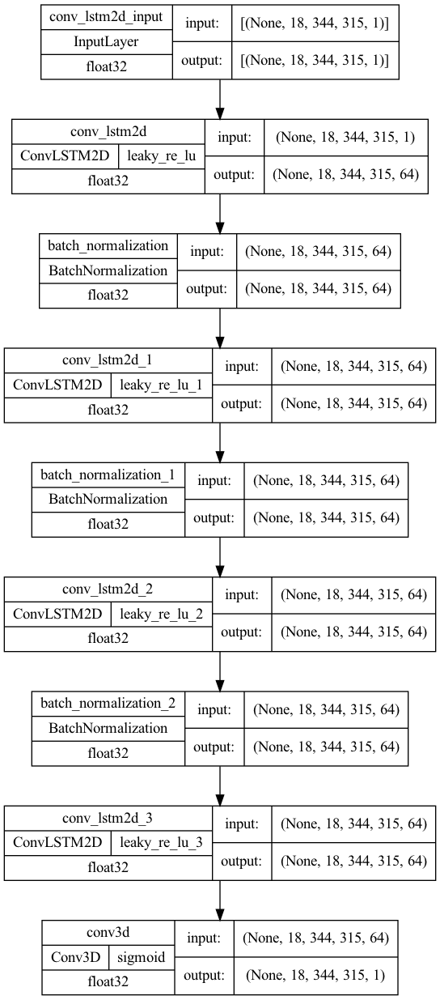

## Short-term precipitation forecasting from weather radar data using Convolutional LSTM neural networks
This is the repository with the code accompanying this [Medium article](https://medium.com/@petrosdemetrakopoulos/short-term-precipitation-forecasting-using-convolutional-lstm-neural-networks-f347db1b5f1d).The relevant paper is also available in [ArXiv](https://arxiv.org/abs/2312.01197)

## The model
The model was developed using Tensorflow and Keras

## Results


## Cite
```
@misc{demetrakopoulos2023shortterm,
      title={Short-term Precipitation Forecasting in The Netherlands: An Application of Convolutional LSTM neural networks to weather radar data}, 
      author={Petros Demetrakopoulos},
      year={2023},
      eprint={2312.01197},
      archivePrefix={arXiv},
      primaryClass={cs.LG}
}
```
