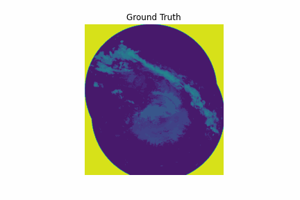
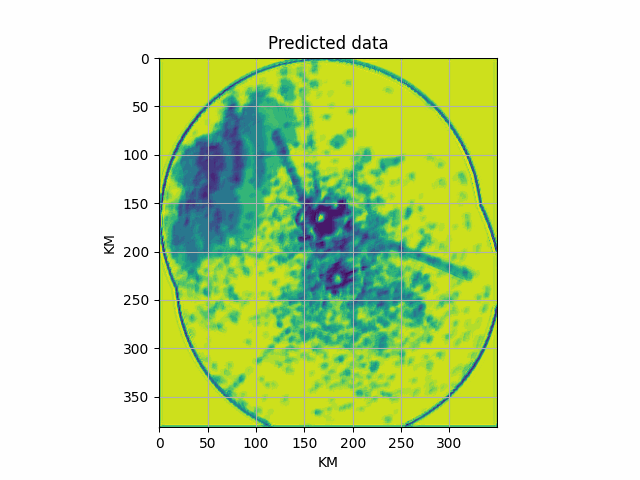

## Short-term precipitation forecasting from weather radar data using Convolutional LSTM neural networks
This is the repository with the code accompanying this Medium article.

https://medium.com/@petrosdemetrakopoulos/short-term-precipitation-forecasting-from-weather-radar-data-using-convolutional-lstm-neural-f347db1b5f1d

## Results

