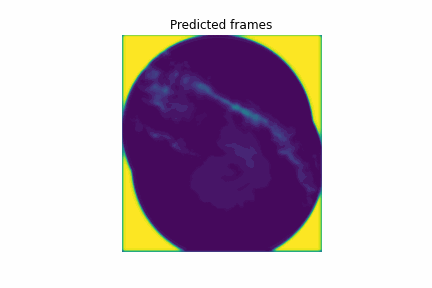

## Short-term precipitation forecasting from weather radar data using Convolutional LSTM neural networks
This is the repository with the code accompanying this Medium article.

## The model
The model was developed using Tensorflow and Keras

## Results

